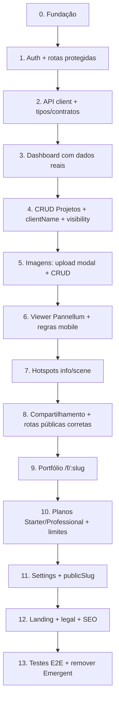

# Relatório de Auditoria — Frontend FIVI360 (base Emergent)

**Versão:** v1  
**Data:** 31/05/2026  
**Escopo:** Auditoria somente leitura do projeto em `frontend/`  
**Status:** Protótipo visual gerado pelo Emergent — sem funcionalidade real

---

## 1. Resumo da estrutura

| Aspecto | Situação atual |
|--------|----------------|
| **Framework** | React 19 + Create React App via **CRACO** (`craco start/build/test`) |
| **Roteamento** | React Router DOM v7 (`BrowserRouter`, rotas declarativas em `App.js`) |
| **Estilos** | Tailwind CSS 3 + variáveis shadcn em `index.css` + utilitários custom em `App.css` |
| **UI kit** | shadcn/ui (estilo **new-york**, 46 componentes em `src/components/ui/`) — **instalados, não usados nas páginas** |
| **Ícones** | lucide-react |
| **Linguagem** | JavaScript (`.js` / `.jsx`), sem TypeScript |
| **Alias** | `@/` → `src/` (CRACO + `jsconfig.json`) |
| **Origem** | Gerado pelo **Emergent** (visual-edits, badge, PostHog, script externo no HTML) |
| **Estado funcional** | 100% visual/mock — sem API, auth, persistência ou viewer 360 real |

### Árvore relevante

```
frontend/
├── docs/                    # product, business-rules, roadmap (fora do src)
├── plugins/health-check/    # webpack health (opcional via env)
├── public/
│   └── index.html           # único arquivo público (Emergent + PostHog)
├── src/
│   ├── App.js / App.css
│   ├── index.js / index.css
│   ├── components/
│   │   ├── Layout.js        # único componente de app
│   │   └── ui/              # 46 componentes shadcn (scaffold)
│   ├── hooks/use-toast.js
│   ├── lib/utils.js         # cn() helper
│   └── pages/               # 9 páginas (.js)
├── tailwind.config.js
├── components.json          # config shadcn
├── craco.config.js
└── package.json
```

### Dependências relevantes

| Pacote | Uso real no código |
|--------|-------------------|
| `react`, `react-dom`, `react-router-dom` | Sim — core |
| `tailwindcss`, `clsx`, `tailwind-merge`, `class-variance-authority` | Sim — estilos |
| `@radix-ui/*`, shadcn ui | Só dentro de `components/ui/` |
| `lucide-react` | Sim — todas as páginas |
| `axios` | **Não usado** |
| `react-hook-form`, `@hookform/resolvers`, `zod` | **Não usado** |
| `recharts` | **Não usado** |
| `date-fns`, `react-day-picker` | **Não usado** |
| `next-themes` | **Não usado** |
| `sonner`, toast shadcn | **Não montados** em `App.js` |
| `@emergentbase/visual-edits` | Dev only (CRACO) |

### Assets

- **Nenhuma imagem local** em `public/` ou `src/` (sem favicon, logo, manifest).
- Todas as imagens vêm de URLs **Unsplash** hardcoded nos mocks.
- Fontes via Google Fonts (Outfit + Manrope em `index.css`; Inter só no badge Emergent no HTML).

### Estilos globais

- **`index.css`**: tokens shadcn (`:root` / `.dark`), body `#050505`, tipografia Outfit/Manrope, regras Emergent `[data-debug-wrapper]`.
- **`App.css`**: `.card-hover`, `.image-zoom-hover`, `.btn-scale`, `.fade-in`.
- **Observação**: tema `.dark` está definido, mas **nunca é aplicado** no `<html>`; páginas usam cores hardcoded (`#050505`, `zinc-*`, `white`).

---

## 2. Rotas existentes

| Rota | Arquivo | Layout | Auth guard |
|------|---------|--------|------------|
| `/` | redirect → `/dashboard` | — | Não |
| `/dashboard` | `Dashboard.js` | Sidebar | Não |
| `/projects` | `Projects.js` | Sidebar | Não |
| `/projects/new` | `NewProject.js` | Sidebar | Não |
| `/projects/:id` | `ProjectDetail.js` | Sidebar | Não |
| `/viewer/:projectId/:imageId` | `Viewer.js` | Fullscreen | Não |
| `/plan` | `Plan.js` | Sidebar | Não |
| `/settings` | `Settings.js` | Sidebar | Não |
| `/share/project/:id` | `PublicProject.js` | Público | Não |
| `/share/image/:projectId/:imageId` | `PublicImage.js` | Público | Não |

### Rotas esperadas pelo produto e ausentes

| Funcionalidade | Rota esperada (docs) | Status |
|----------------|---------------------|--------|
| Autenticação | `/login`, `/register`, etc. | ❌ |
| Portfólio público | `/f/:publicSlug` | ❌ |
| Compartilhamento imagem | `/share/image/:imageId` | ⚠️ diverge (usa `projectId` + `imageId`) |
| Landing page | `/` ou `/home` | ❌ (redirect direto ao dashboard) |
| Ajuda / Termos / Privacidade | — | ❌ |
| Editor de hotspots | — | ❌ |
| 404 / fallback | — | ❌ |

---

## 3. Páginas visuais existentes

### 3.1 `Dashboard.js` — `/dashboard`

| Item | Detalhe |
|------|---------|
| **Objetivo** | Visão geral: stats + projetos recentes |
| **Componentes** | Grid de stat cards, grid de project cards, botão "Criar projeto" |
| **Mock** | Sim — `mockProjects` (3 itens) + stats hardcoded (24, 156, 18, 2.4 GB) |
| **Ações sem função** | Stats estáticos; cards navegam para `/projects/:id` |
| **Observações** | Duplica `mockProjects` de `Projects.js`; status usa "Não listado" em vez de `shared` |

### 3.2 `Projects.js` — `/projects`

| Item | Detalhe |
|------|---------|
| **Objetivo** | Listagem de projetos com menu de ações |
| **Componentes** | Header, grid de cards, dropdown custom (MoreVertical) |
| **Mock** | Sim — `mockProjects` (6 itens) |
| **Ações sem função** | "Ver projeto" (sem `Link`), "Excluir" (sem handler) |
| **Observações** | Menu dropdown é `<div>` inline, não shadcn `DropdownMenu` |

### 3.3 `ProjectDetail.js` — `/projects/:id`

| Item | Detalhe |
|------|---------|
| **Objetivo** | Detalhe do projeto + galeria de imagens (grid/lista) |
| **Componentes** | Hero do projeto, toggle grid/lista, cards de imagem, menus contextuais |
| **Mock** | Sim — `mockProject` fixo (ignora `:id` da URL) |
| **Ações sem função** | Compartilhar, Adicionar imagem, Renomear, Excluir |
| **Observações** | Falta `clientName`; visibilidade "Público/Privado/Não listado" vs `private/shared/public` |

### 3.4 `NewProject.js` — `/projects/new`

| Item | Detalhe |
|------|---------|
| **Objetivo** | Formulário de criação de projeto |
| **Componentes** | Upload capa (visual), inputs nome/descrição, radio visibilidade, submit/cancelar |
| **Mock** | Form local com `useState`; submit faz `console.log` + `navigate('/projects')` após 500 ms |
| **Ações sem função** | Upload de capa (input file sem preview/handler); sem campo `clientName` |
| **Observações** | Formulário nativo HTML, não usa shadcn `Form`/`Input` |

### 3.5 `Viewer.js` — `/viewer/:projectId/:imageId`

| Item | Detalhe |
|------|---------|
| **Objetivo** | Visualização 360° imersiva |
| **Componentes** | Overlay top (voltar, compartilhar), imagem fullscreen, controles zoom/fullscreen, rodapé info |
| **Mock** | Sim — `mockImage` fixo (ignora params da URL) |
| **Ações parciais** | Zoom CSS (`scale`), fullscreen nativo do browser |
| **Ações sem função** | Compartilhar; **não há viewer 360** (imagem estática `object-cover`); hint "Arraste/Scroll" não implementado |
| **Observações** | Sem sidebar; sem hotspots; mobile ainda mostra zoom/fullscreen (contrário às regras de negócio) |

### 3.6 `Settings.js` — `/settings`

| Item | Detalhe |
|------|---------|
| **Objetivo** | Perfil e dados do escritório |
| **Componentes** | Seção perfil, upload logo (visual), inputs, botão salvar |
| **Mock** | Valores iniciais hardcoded (`João Silva`, etc.) |
| **Ações sem função** | Upload logo; submit → `console.log` apenas |
| **Observações** | Falta config de `publicSlug` para portfólio |

### 3.7 `Plan.js` — `/plan`

| Item | Detalhe |
|------|---------|
| **Objetivo** | Escolha de plano + consumo atual |
| **Componentes** | 3 pricing cards, barras de progresso de uso |
| **Mock** | Sim — array `plans` + stats de consumo hardcoded |
| **Ações sem função** | Botões "Assinar" (sem checkout/Stripe) |
| **Observações** | Planos "Gratuito/Profissional/Enterprise" ≠ roadmap "Starter/Professional"; features não batem com business-rules (hotspots, portfólio) |

### 3.8 `PublicProject.js` — `/share/project/:id`

| Item | Detalhe |
|------|---------|
| **Objetivo** | Página pública de projeto compartilhado |
| **Componentes** | Header logo, hero capa, galeria, footer "Powered by FIVI360" |
| **Mock** | Sim — `mockProject` fixo |
| **Ações sem função** | Capa não abre primeira imagem no mobile (regra de negócio) |
| **Observações** | Layout público próprio; não é portfólio `/f/:slug` |

### 3.9 `PublicImage.js` — `/share/image/:projectId/:imageId`

| Item | Detalhe |
|------|---------|
| **Objetivo** | Viewer público de imagem compartilhada |
| **Componentes** | Quase cópia de `Viewer.js` + badge "Powered by FIVI360" |
| **Mock** | Sim — `mockImage` fixo |
| **Ações parciais** | Zoom CSS, fullscreen |
| **Ações sem função** | Mesmas limitações do Viewer privado |

---

## 4. Layout e navegação

### Sidebar

- **Sim** — `Layout.js`: sidebar fixa 256px (`w-64`), logo FIVI360, 4 itens (Dashboard, Projetos, Plano, Configurações).
- Item ativo: fundo branco, texto preto.
- **Mobile**: botão hamburger fixo, drawer com overlay, fecha ao clicar link ou overlay.

### Navbar / topbar

- **Área autenticada**: não há topbar; só sidebar + conteúdo.
- **Área pública**: header simples em `PublicProject`; `Viewer`/`PublicImage` usam overlay flutuante.

### Layouts distintos

| Tipo | Onde | Características |
|------|------|-----------------|
| **Autenticado** | Rotas com `<Layout>` | Sidebar + `main` scrollável |
| **Fullscreen viewer** | `/viewer/*`, `/share/image/*` | Sem chrome lateral |
| **Público projeto** | `/share/project/:id` | Header + footer próprios |

Não há componente `PublicLayout` reutilizável — padrões repetidos manualmente.

### Responsividade

- Breakpoints Tailwind usados de forma consistente: `sm:`, `md:`, `lg:`.
- Grids: 1 col → 2 → 3/4 colunas.
- Padding escalonado: `p-8 md:p-12 lg:p-16`.
- Sidebar colapsável no mobile — **funcional visualmente**.
- **Problemas potenciais**:
  - Viewer: controles inferiores lado a lado podem apertar em telas pequenas.
  - Hint central fixo no viewer pode sobrepor conteúdo em mobile.
  - Header de `Projects`/`Dashboard` com botão "Criar projeto" pode quebrar em telas estreitas (flex sem wrap explícito).

### Componentes aparentemente reutilizáveis (hoje inline)

| Padrão | Onde aparece | Reutilizável? |
|--------|--------------|---------------|
| Page header (título + subtítulo) | Todas as páginas autenticadas | Sim — duplicado ~8x |
| Stat card | Dashboard, Plan | Sim |
| Project card | Dashboard, Projects, PublicProject | Sim — 3 variantes |
| Image card | ProjectDetail, PublicProject | Sim |
| Primary button (branco, rounded-full) | Várias páginas | Sim — inline Tailwind |
| Dropdown menu custom | Projects, ProjectDetail | Sim — candidato a shadcn |
| Viewer overlay | Viewer, PublicImage | Sim — quase duplicado |
| Back link | NewProject, ProjectDetail, Viewer | Sim |
| Pricing card | Plan | Sim |

---

## 5. Design system visual

### Cores principais

| Token visual | Valor | Uso |
|--------------|-------|-----|
| Background app | `#050505` | body, sidebar, viewers |
| Superfície card | `bg-zinc-900/50` + `border-zinc-800` | cards, forms |
| Superfície elevada | `bg-zinc-800`, `bg-zinc-900` | inputs, ícones, menus |
| Texto primário | `text-white` | títulos, valores |
| Texto secundário | `text-zinc-400` / `text-zinc-300` | labels, descrições |
| Acento / CTA | `bg-white text-black` | botões primários, item nav ativo |
| Destructive | `text-red-400` | excluir |
| Overlay viewer | `bg-black/60 backdrop-blur-xl border-white/10` | controles flutuantes |

Tokens shadcn (`primary`, `muted`, etc.) existem mas **não são usados nas páginas**.

### Tipografia

- **Headings**: Outfit, `font-light`, `tracking-tighter` — títulos grandes (4xl–6xl).
- **Body**: Manrope.
- Hierarquia clara: H1 página → H2 seção → H3 card.

### Padrão de cards

```
bg-zinc-900/50 border border-zinc-800 rounded-2xl overflow-hidden
+ .card-hover (borda zinc-600 no hover)
+ imagem h-48 object-cover + .image-zoom-hover
+ padding p-4/p-6
```

### Padrão de botões

| Variante | Classes típicas |
|----------|-----------------|
| Primário | `px-6/8 py-3 bg-white text-black rounded-full font-medium btn-scale hover:bg-zinc-200` |
| Secundário | `bg-zinc-800 border border-zinc-700 text-white rounded-full/xl` |
| Ghost/icon | `p-2 text-zinc-400 hover:text-white` |
| Toggle ativo | `bg-white text-black rounded-lg` dentro de grupo |

shadcn `Button` existe mas páginas **não o importam**.

### Modais

- **Nenhum modal implementado** (upload, share, confirmação de delete).
- shadcn `Dialog`, `AlertDialog`, `Sheet` disponíveis para reconstrução.

### Espaçamento e utilitários

- Page container: `p-8 md:p-12 lg:p-16` + `.fade-in`.
- Grids: `gap-6`.
- Border radius: `rounded-2xl` (cards), `rounded-xl` (inputs/menus), `rounded-full` (CTAs, badges).
- Custom: `.card-hover`, `.image-zoom-hover`, `.btn-scale`, `.fade-in`.
- `data-testid` extensivo (~70 ocorrências) — indício de scaffold para testes E2E futuros.

---

## 6. Oportunidades de reaproveitamento

### Preservar com prioridade alta

1. **`Layout.js`** — sidebar responsiva, identidade visual, navegação principal.
2. **`App.css`** — micro-interações (hover cards, zoom imagem, scale botão, fade-in).
3. **Padrões visuais de cards** — stat, project, image, pricing (extrair para componentes na reconstrução).
4. **Overlay do viewer** — estrutura de controles (adaptar para Pannellum + regras mobile).
5. **`index.css`** — fontes e tokens (alinhar uso real aos tokens shadcn).
6. **Biblioteca shadcn completa** — base sólida para modais, forms, toasts, dropdowns.

### Preservar como referência visual (não como lógica)

- Estrutura de cada página em `src/pages/` — wireframe funcional claro.
- `data-testid` — útil para testes automatizados na reconstrução.

### Não reaproveitar diretamente

- Objetos `mock*` duplicados — substituir por camada de API/hooks.
- Dropdowns inline — migrar para shadcn `DropdownMenu`.
- Inputs/forms nativos — migrar para shadcn + react-hook-form + zod.
- Viewer simulado — substituir por Pannellum (conforme roadmap).
- Rotas e nomenclatura de visibilidade — alinhar às business-rules.

---

## 7. Riscos

### Arquivos grandes / acoplamento

| Arquivo | Linhas | Risco |
|---------|--------|-------|
| `ProjectDetail.js` | ~218 | Maior página; UI + mock + menus + 2 view modes no mesmo arquivo |
| `Plan.js` | ~175 | Pricing + usage stats acoplados |
| `NewProject.js` | ~156 | Form completo inline |
| 46 arquivos `ui/` | ~50–180 cada | **Dead weight no bundle** até serem importados ou tree-shaken |

Nenhum arquivo é crítico por tamanho, mas **toda lógica está monolítica nas páginas** — sem `services/`, `hooks/`, `context/`.

### Duplicação visual e de código

- `mockProjects` duplicado: `Dashboard.js` + `Projects.js`.
- `mockProject` duplicado: `ProjectDetail.js` + `PublicProject.js`.
- `mockImage` + lógica de zoom/fullscreen duplicada: `Viewer.js` + `PublicImage.js`.
- Page headers, stat cards, primary buttons copiados em cada página.

### Código mockado

- 100% dos dados são mocks locais ou constantes.
- `:id`, `:projectId`, `:imageId` da URL **não alteram conteúdo exibido**.
- Submit de forms → `console.log` ou redirect fake.

### Rotas faltando / divergentes

- Sem auth, landing, portfólio, legal, 404.
- `/share/image/:projectId/:imageId` ≠ `/share/image/:imageId` (docs).
- `/` redireciona ao dashboard sem verificar sessão.

### Componentes acoplados

- Páginas não usam shadcn nem `Layout` subcomponentes.
- Menus de contexto misturam estado local + markup inline.
- Viewer acoplado a mock; sem abstração `PanoramaViewer`.

### Responsividade

- Sidebar mobile: OK.
- Viewer controls em mobile: provável overflow (não testado em runtime nesta auditoria).
- Regras mobile do produto (sem zoom/fullscreen, rodapé simplificado) **não implementadas**.

### Dependências problemáticas

| Item | Risco |
|------|-------|
| **CRA + react-scripts 5** | Stack em manutenção; React 19 pode gerar fricção |
| **react-day-picker 8** | Peer dependency com React 19 potencialmente conflituosa (não usado ainda) |
| **axios, recharts, etc.** | Bundle bloat se não removidos ou utilizados |
| **Emergent** (`visual-edits`, badge, PostHog, `emergent-main.js`) | Dependência de plataforma; remover na produção FIVI360 |
| **Imagens Unsplash externas** | Quebram offline; não representam panorâmicas 360 |
| **Sem testes** | 0 arquivos `.test`/`.spec` apesar dos `data-testid` |

### Divergências produto vs protótipo

| Protótipo | Documentação FIVI360 |
|-----------|---------------------|
| "Privado / Não listado / Público" | `private / shared / public` |
| Sem `clientName` | Campo obrigatório em projetos |
| Planos Gratuito/Pro/Enterprise | Starter/Professional |
| Viewer = imagem estática | Pannellum 360° + hotspots |
| Sem portfólio `/f/:slug` | Portfólio com slug único |

---

## 8. Inventários consolidados

### Páginas encontradas (9)

1. `Dashboard.js`
2. `Projects.js`
3. `ProjectDetail.js`
4. `NewProject.js`
5. `Viewer.js`
6. `Settings.js`
7. `Plan.js`
8. `PublicProject.js`
9. `PublicImage.js`

### Componentes úteis

| Componente | Tipo | Status |
|------------|------|--------|
| `Layout.js` | App | Em uso — preservar |
| `components/ui/*` (46) | shadcn | Scaffold — usar na reconstrução |
| `lib/utils.js` | Util | Em uso indireto (shadcn) |
| `hooks/use-toast.js` | Hook | Não montado |

### Principais riscos (top 10)

1. Protótipo visual tratado como base funcional — params de rota ignorados.
2. Duplicação massiva de mocks e UI entre páginas.
3. shadcn instalado mas bypassed — dois design systems paralelos.
4. Viewer não é 360° — retrabalho total na Sprint 5.
5. Rotas e nomenclaturas divergentes das business-rules.
6. Páginas críticas do MVP ausentes (auth, landing, portfólio, legal).
7. Emergent/PostHog/badge no HTML — limpar antes do go-live.
8. CRA como base — considerar migração futura (Vite) sem bloquear MVP.
9. Dependências não usadas inflando o projeto.
10. Zero testes apesar de `data-testid` preparado.

---

## 9. Recomendação de ordem para reconstrução funcional

Alinhada ao `docs/roadmap.md` e ao que o protótipo visual já cobre:

```
Fase 0 — Fundação
  → Extrair componentes visuais (PageHeader, StatCard, ProjectCard, etc.)
  → Adotar shadcn de fato (Button, Input, Dialog, DropdownMenu, Toaster)
  → Normalizar visibilidade: private | shared | public
  → Definir AuthenticatedLayout / PublicLayout / ViewerLayout

Fase 1 — Auth (Sprint 1)
  → Construir telas do zero; redirecionar / conforme sessão

Fase 2 — Dashboard (Sprint 2)
  → Reaproveitar layout visual; conectar stats e listas à API

Fase 3 — Projetos (Sprint 3)
  → Reaproveitar Projects, NewProject, ProjectDetail; adicionar clientName

Fase 4 — Imagens (Sprint 4)
  → Modals: upload preview, rename, delete confirm, share

Fase 5 — Viewer (Sprint 5)
  → Pannellum; unificar Viewer + PublicImage; regras mobile

Fase 6 — Hotspots (Sprint 6)
  → Nova UI — protótipo não antecipa

Fase 7 — Público (Sprints 7–8)
  → Corrigir rotas de share; portfólio /f/:slug; planos Starter/Professional

Fase 8 — Go-live (Sprints 9–10)
  → Landing, termos, privacidade, SEO, remover Emergent, testes
```

### Fluxo recomendado



---

## Conclusão

O frontend Emergent entrega um **protótipo visual coerente** para o núcleo autenticado (dashboard, projetos, settings, planos) e um **esboço parcial** do fluxo público (share project/image + viewer fake). A identidade visual dark premium (Outfit/Manrope, cards zinc, CTAs brancos) vale ser preservada via `Layout.js`, `App.css` e extração dos padrões repetidos nas páginas.

Porém, **nada é funcional**: mocks duplicados, URL params ignorados, viewer não 360°, modals inexistentes, auth/landing/portfólio/legal ausentes, e shadcn instalado mas não integrado. A reconstrução deve tratar este código como **referência de UI/wireframe**, não como base de lógica — começando por fundação (componentes + API + auth) antes de conectar página a página conforme o roadmap.
