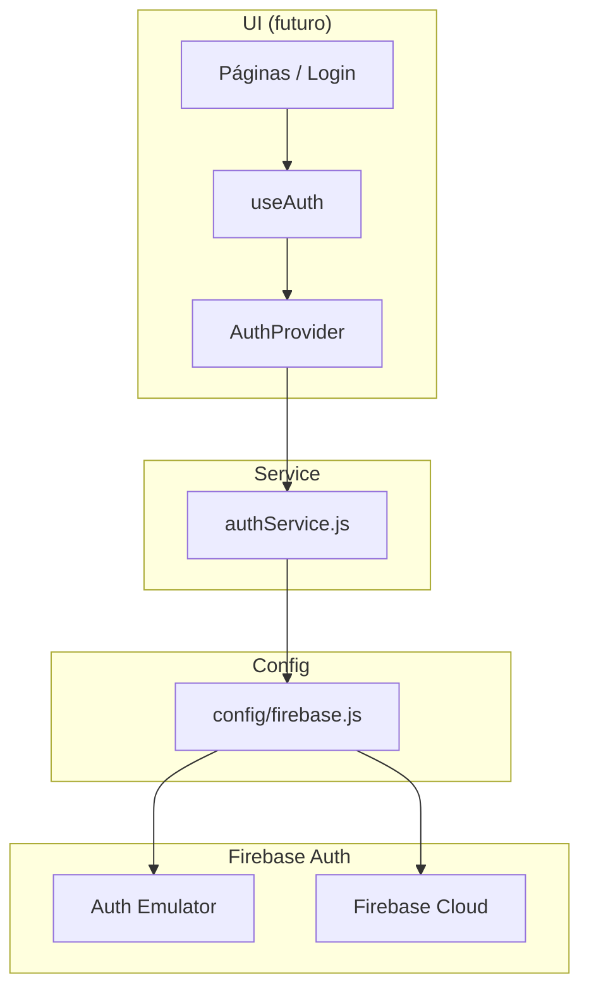

# Auth Foundation — Sprint 1.2

Documentação da fundação de autenticação do FIVI360 com **Firebase Auth**. O `AuthProvider` está integrado ao app, mas **nenhuma tela, rota ou fixture foi alterada** nesta sprint.

## Objetivo

Disponibilizar camada de autenticação reutilizável (service + context + hook) para que sprints seguintes implementem telas de login/cadastro, rotas protegidas e perfil Firestore sem refatorar a arquitetura.

## Restrições desta sprint

| Permitido | Não permitido |
|-----------|---------------|
| Implementar `authService`, `AuthContext`, `useAuth` | Criar telas de login/cadastro |
| Integrar `AuthProvider` no topo do app | Proteger ou redirecionar rotas |
| Documentação | Alterar layout visual |
| | Remover ou substituir fixtures |
| | Conectar páginas existentes ao Firebase |

Fixtures em `src/fixtures/` continuam sendo a fonte de dados das telas.

---

## Arquivos criados/ajustados

| Arquivo | Papel |
|---------|-------|
| `src/services/auth/authService.js` | Chamadas ao Firebase Auth (SDK) |
| `src/contexts/AuthContext.jsx` | Provider React com estado de sessão |
| `src/hooks/useAuth.js` | Hook para consumir o contexto |
| `src/index.js` | Envolve `<App />` com `<AuthProvider>` |
| `docs/auth-foundation.md` | Esta documentação |

Dependência de configuração: `src/config/firebase.js` (Sprint 1.1).

---

## Arquitetura



Páginas e componentes **não** importam o SDK Firebase diretamente — usam `useAuth()` ou, em casos excepcionais, funções do `authService`.

---

## authService.js — funções disponíveis

Todas as funções delegam ao Firebase Auth via instância exportada em `@/config/firebase`.

| Função | Descrição | Retorno |
|--------|-----------|---------|
| `signInWithEmail(email, password)` | Login com e-mail e senha | Usuário normalizado |
| `signUpWithEmail(email, password)` | Cadastro com e-mail e senha | Usuário normalizado |
| `signInWithGoogle()` | Login OAuth com popup Google | Usuário normalizado |
| `logout()` | Encerra a sessão atual | `void` |
| `resetPassword(email)` | Envia e-mail de recuperação de senha | `void` |
| `subscribeToAuthChanges(callback)` | Listener `onAuthStateChanged` | Função `unsubscribe` |
| `mapFirebaseUser(firebaseUser)` | Normaliza `User` do SDK | Objeto ou `null` |

### Formato do usuário normalizado

```js
{
  uid: string,
  email: string | null,
  displayName: string | null,
  photoURL: string | null,
  emailVerified: boolean,
}
```

Este objeto representa a **sessão Firebase Auth**. O documento completo em Firestore (`users/{uid}`) será criado em sprint futura (`userService`).

---

## AuthProvider — como funciona

O `AuthProvider` é montado em `src/index.js`, envolvendo toda a árvore React:

```jsx
<AuthProvider>
  <App />
</AuthProvider>
```

### Estado exposto

| Propriedade | Tipo | Descrição |
|-------------|------|-----------|
| `user` | objeto \| `null` | Usuário autenticado normalizado; `null` se deslogado |
| `loading` | `boolean` | `true` até a primeira resposta de `onAuthStateChanged` |
| `error` | `Error` \| `null` | Último erro de uma operação de auth |

### Métodos expostos

| Método | Delega para |
|--------|-------------|
| `signIn(email, password)` | `authService.signInWithEmail` |
| `signUp(email, password)` | `authService.signUpWithEmail` |
| `signInGoogle()` | `authService.signInWithGoogle` |
| `signOut()` | `authService.logout` |
| `resetPassword(email)` | `authService.resetPassword` |

Comportamento dos métodos:

1. Limpam `error` antes de executar.
2. Chamam o `authService` correspondente.
3. Em caso de falha, gravam o erro em `error` e relançam a exceção (para a UI tratar toast/mensagem).
4. Em caso de sucesso, `user` é atualizado automaticamente pelo listener `subscribeToAuthChanges`.

### Ciclo de vida da sessão

1. Montagem do provider → `loading: true`, `user: null`.
2. `subscribeToAuthChanges` registra `onAuthStateChanged`.
3. Primeiro callback → define `user` e `loading: false`.
4. Login/logout subsequentes → `user` atualizado pelo mesmo listener.

---

## useAuth.js

```js
import { useAuth } from "@/hooks/useAuth";

function Example() {
  const { user, loading, signIn, signOut } = useAuth();
  // ...
}
```

Se o hook for usado **fora** de `<AuthProvider>`, lança:

```text
useAuth deve ser usado dentro de AuthProvider
```

O contexto é criado com valor padrão `undefined` (sem fallback), garantindo essa validação.

---

## Desenvolvimento local com emulador

Com emuladores ativos (`REACT_APP_USE_FIREBASE_EMULATORS=true`), Auth usa o Emulator na porta configurada (padrão `9099`).

Fluxo sugerido para testar auth manualmente (DevTools ou sprint futura de telas):

1. `firebase emulators:start`
2. `yarn start` com `.env.local` apontando ao emulador
3. Cadastrar usuário via Emulator UI ou chamada programática a `signUp`

---

## Próximos passos (Sprint 1.3+)

1. **Telas de login e cadastro** — formulários que consomem `signIn`, `signUp`, `signInGoogle` e `resetPassword`.
2. **Rotas protegidas** — wrapper que redireciona não autenticados para `/login`; respeitar `loading` para evitar flash.
3. **Perfil Firestore** — após primeiro login, criar `users/{uid}` e `publicProfiles/{uid}` via `userService` (`displayName`, `plan`, etc.).
4. **Logout na UI** — botão em Settings/Layout usando `signOut`.
5. **Migrar dados das páginas** — substituir fixtures por services (projects, images) **após** auth estável.
6. **Security Rules** — regras Firestore/Storage amarradas a `request.auth.uid`.

---

## Referências

- [firebase-foundation.md](./firebase-foundation.md) — SDK, env vars, emuladores
- [architecture.md](./architecture.md) — modelos `User`, Authentication
- [business-rules.md](./business-rules.md) — planos e visibilidade

---

## Checklist Sprint 1.2

- [x] `authService.js` com login, cadastro, Google, logout, reset e listener
- [x] `AuthProvider` com `user`, `loading`, `error` e métodos expostos
- [x] `useAuth` com validação de provider
- [x] `AuthProvider` integrado em `src/index.js`
- [x] Sem alteração de rotas, layout ou fixtures
- [x] Documentação `docs/auth-foundation.md`
