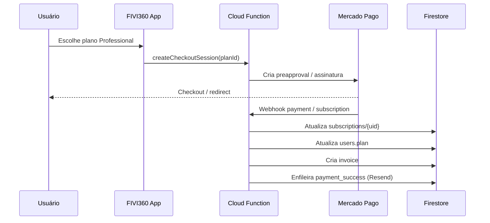

# Billing Foundation — FIVI360

Fundação de billing para integração futura com **Mercado Pago** (único provider de pagamento).

> **Esta sprint não inclui pagamento real.** Checkout, webhooks e alteração de plano serão implementados em sprint posterior.

## Provider

```js
export const BILLING_PROVIDER = "mercado_pago";
```

Não há integração Stripe no projeto.

## Modelo `users/{uid}.plan`

Plano atual do usuário — fonte de verdade para limites e UI.

```js
plan: {
  id: "starter",           // starter | professional | enterprise
  status: "active",        // active | trialing | past_due | canceled | unpaid
  source: "system",        // system | mercado_pago | manual_admin
  startedAt: null,
  currentPeriodEnd: null,
  updatedAt: null,
}
```

### Compatibilidade legada

Usuários com `plan: "starter"` (string) são normalizados em leitura via `normalizeUserPlan()` em `src/config/billing.js` — sem migração obrigatória no Firestore.

Novos cadastros recebem o objeto completo (`DEFAULT_USER_PLAN`).

## Coleção `subscriptions/{uid}`

Um documento por usuário (ID = `uid`). Para Starter, o documento **pode não existir** — nesse caso, considerar plano Starter ativo.

```js
{
  userId: uid,
  provider: "mercado_pago",
  planId: "starter",
  status: "inactive",       // inactive | active | trialing | past_due | canceled | unpaid
  providerSubscriptionId: null,
  payerId: null,
  currentPeriodStart: null,
  currentPeriodEnd: null,
  cancelAtPeriodEnd: false,
  canceledAt: null,
  createdAt: serverTimestamp(),
  updatedAt: serverTimestamp(),
}
```

**Escrita:** apenas Cloud Functions / Admin SDK (cliente não cria/atualiza).

## Coleção `invoices/{invoiceId}`

Histórico de cobranças.

```js
{
  userId: uid,
  subscriptionId: null,
  provider: "mercado_pago",
  providerPaymentId: null,
  planId: "professional",
  amount: 49,
  currency: "BRL",
  status: "pending",        // pending | paid | failed | refunded | canceled
  paidAt: null,
  invoiceUrl: null,
  createdAt: serverTimestamp(),
  updatedAt: serverTimestamp(),
}
```

**Leitura:** owner (`userId == auth.uid`). **Escrita:** apenas backend.

Índice composto: `userId` ASC + `createdAt` DESC (`firestore.indexes.json`).

## Configuração de planos

`src/config/billing.js` — `BILLING_PLANS`:

| Plano        | Preço/mês | Env Mercado Pago (backend only) |
|--------------|-----------|----------------------------------|
| Starter      | R$ 0      | —                                |
| Professional | R$ 49     | `MP_PLAN_PROFESSIONAL`           |
| Enterprise   | R$ 149    | `MP_PLAN_ENTERPRISE`             |

IDs dos planos Mercado Pago **não** vão no frontend (`REACT_APP_*`). Configure em `functions/.secret.local` (emulador) ou Firebase Secrets (produção). Ver `functions/src/config/billing.js`.

`APP_BASE_URL` (em `functions/.env` ou params do Firebase) deve ser `https://fivi360.web.app` em produção e no emulador — Mercado Pago rejeita Firebase Hosting preview channels como `back_url`.

## Services (`src/services/billing/billingService.js`)

| Função                     | Comportamento atual                          |
|----------------------------|----------------------------------------------|
| `getCurrentPlan(user)`     | Normaliza `users.plan`                       |
| `getSubscription(userId)`  | Lê `subscriptions/{uid}` ou `null`           |
| `getInvoices(userId)`      | Lista `invoices` por `userId`                |
| `requestUpgrade(planId)`   | Placeholder — mensagem controlada            |
| `requestCancelSubscription()` | Placeholder — mensagem controlada       |

Helpers: `normalizeUserPlan`, `isPaidPlan`, `isSubscriptionActive`.

## Página `/plan`

- Plano atual: `normalizeUserPlan(userData)`
- Assinatura: `subscriptions/{uid}` (Starter se ausente)
- Histórico: `invoices` filtrado por `userId` (vazio até cobranças reais)
- Upgrade/cancelamento: mensagem *"Pagamentos serão ativados em breve."*

## Firestore Rules

- `subscriptions/{userId}`: owner pode `get`; sem `create`/`update`/`delete` no cliente
- `invoices/{invoiceId}`: owner pode `get` e `list` (query por `userId`); sem escrita no cliente

## Fluxo futuro de upgrade



## Fluxo futuro de webhook

1. Mercado Pago envia evento (pagamento, falha, cancelamento).
2. Cloud Function valida assinatura do webhook.
3. Atualiza `subscriptions/{uid}`, `users.plan` e `invoices/{id}` conforme evento.
4. Enfileira e-mail transacional na `emailQueue` (quando templates estiverem prontos).

## Integração futura com Resend

Tipos planejados (ainda **sem template** nem envio):

| Tipo                    | Quando disparar              |
|-------------------------|------------------------------|
| `payment_success`       | Cobrança confirmada          |
| `payment_failed`        | Falha na cobrança recorrente |
| `subscription_canceled` | Cancelamento efetivado       |

Ver `functions/src/config/email.js` e `docs/resend-email-plan.md`.

## O que NÃO está nesta sprint

- Mercado Pago SDK/API
- Checkout real
- Webhook real
- Alteração real de plano
- Cancelamento real
- Faturas reais
- E-mails de pagamento

## Arquivos principais

| Arquivo | Papel |
|---------|-------|
| `src/config/billing.js` | Config, tipos, normalização |
| `src/services/billing/billingService.js` | Leitura Firestore + placeholders |
| `src/pages/Plan.js` | UI de plano e histórico |
| `firestore.rules` | Regras subscriptions/invoices |
| `firestore.indexes.json` | Índice invoices |
