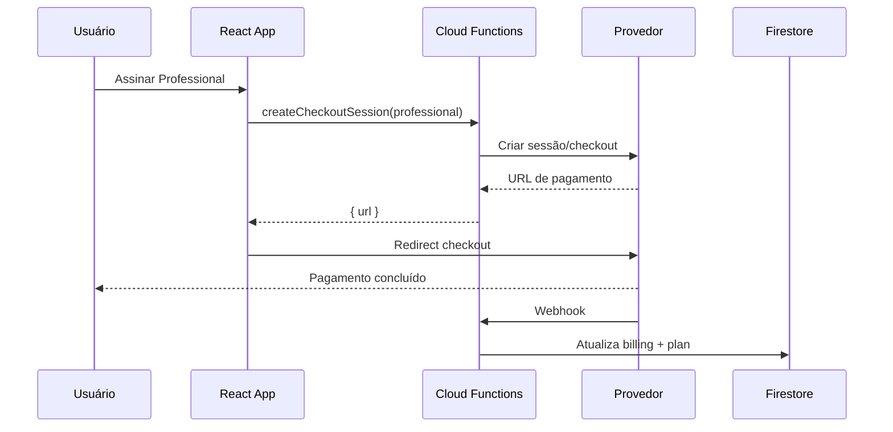

# Plano de billing agnóstico ao provedor (FIVI360)

Este documento descreve a arquitetura preparada para pagamentos no FIVI360, sem acoplar o frontend a Stripe ou Mercado Pago. **Nenhum pagamento real está ativo nesta sprint.**

## Por que a arquitetura é genérica

- O público brasileiro pode preferir **Mercado Pago**; Stripe continua sendo opção internacional.
- Trocar de provedor não deve exigir reescrever telas (`/plan`, modal de upgrade, landing).
- O modelo Firestore usa nomes **neutros** (`customerId`, `subscriptionId`, `priceId`) em vez de prefixos `stripe*`.
- Dados específicos de cada provedor ficam isolados em `billingProviderData.stripe` e `billingProviderData.mercadoPago`.
- O frontend chama apenas `billingService` (stubs hoje); integrações reais ficam no **backend** (Cloud Functions).

## Configuração (`src/config/billing.js`)

| Constante | Função |
|-----------|--------|
| `BILLING_PROVIDER` | Identificadores: `stripe`, `mercado_pago` |
| `ACTIVE_BILLING_PROVIDER` | `REACT_APP_BILLING_PROVIDER` (default: `mercado_pago`) |
| `BILLING_STATUS` | Estados de assinatura genéricos |
| `BILLING_PLANS` | Metadados de planos + env vars por provedor |
| `normalizeBilling()` | Leitura segura do Firestore + migração de campos legados `stripe*` |

Variáveis de ambiente (ver `.env.example`):

- `REACT_APP_BILLING_PROVIDER`
- `REACT_APP_STRIPE_PRICE_PROFESSIONAL` / `ENTERPRISE`
- `REACT_APP_MP_PLAN_PROFESSIONAL` / `ENTERPRISE`

## Modelo Firestore (`users/{uid}.billing`)

```json
{
  "provider": "mercado_pago",
  "customerId": "",
  "subscriptionId": "",
  "planId": "",
  "priceId": "",
  "subscriptionStatus": "free",
  "currentPeriodStart": null,
  "currentPeriodEnd": null,
  "nextInvoiceDate": null,
  "cancelAtPeriodEnd": false,
  "lastInvoiceUrl": "",
  "lastPaymentStatus": "",
  "updatedAt": null,
  "billingProviderData": {
    "stripe": {},
    "mercadoPago": {}
  }
}
```

O campo `users.plan` (`starter` | `professional` | `enterprise`) continua sendo a fonte de **limites** do app. Após billing ativo, webhooks devem manter `plan` e `billing` sincronizados.

Usuários antigos com `stripeCustomerId` etc. são normalizados em leitura para os campos genéricos.

## Camada de serviço (`src/services/billing/billingService.js`)

| Função | Comportamento atual | Stripe (futuro) | Mercado Pago (futuro) |
|--------|---------------------|-----------------|------------------------|
| `createCheckoutSession(planId)` | Retorna "Billing ainda não está ativo." | Stripe Checkout Session | Preapproval / checkout de assinatura |
| `createBillingPortalSession()` | Idem | Customer Portal | Página própria ou link MP |
| `cancelSubscription()` | Idem | API cancel at period end | API equivalente MP |
| `getBillingSummary()` | Idem | Agrega Firestore + Stripe | Agrega Firestore + MP |
| `getInvoices()` | Idem + `invoices: []` | Lista invoices Stripe | Lista cobranças MP |

Todas as chamadas devem passar por **Cloud Functions** autenticadas (nunca expor secret keys no React).

## Fluxo de checkout (futuro)



## Fluxo de webhook (futuro)

1. Provedor envia evento (pagamento, renovação, falha, cancelamento).
2. Cloud Function valida assinatura do webhook.
3. Resolve `userId` via `customerId` / metadata.
4. Atualiza `users.billing` e, quando aplicável, `users.plan`.
5. Opcional: grava payload bruto em `billingProviderData.{stripe|mercadoPago}`.

Eventos mínimos a tratar:

- Assinatura criada / ativada → `subscriptionStatus: active`, `plan` atualizado
- Renovação → `currentPeriodEnd`, `nextInvoiceDate`
- Falha de pagamento → `past_due` ou `unpaid`
- Cancelamento → `canceled`, `cancelAtPeriodEnd`

## UI (esta sprint)

- **Sem menção a Stripe ou Mercado Pago** nas telas.
- `/plan`: central de assinatura (consumo, gerenciar, histórico).
- Modal: "Escolha seu plano" + aviso "Pagamentos serão ativados em breve."
- Landing: CTAs levam a `/register?plan=…` ou `/plan?upgrade=…`.
- Login/registro preservam `?plan=` e redirecionam para upgrade.
- Histórico de cobrança: tabela vazia.
- "Gerenciar cobrança": toast "Disponível em breve."

## Como o Stripe entraria

1. Definir `REACT_APP_BILLING_PROVIDER=stripe` e price IDs no `.env`.
2. Cloud Function `createCheckoutSession` usa Stripe SDK com `priceId` de `BILLING_PLANS`.
3. Webhook Stripe (`checkout.session.completed`, `customer.subscription.*`, `invoice.*`).
4. `createBillingPortalSession` retorna URL do Customer Portal.
5. Dados extras (ex.: `payment_method`) em `billingProviderData.stripe`.

## Como o Mercado Pago entraria

1. Definir `REACT_APP_BILLING_PROVIDER=mercado_pago` e plan IDs MP.
2. Cloud Function cria preapproval/plano de assinatura MP.
3. Webhooks MP para status de pagamento e assinatura.
4. Portal de gestão: link MP ou página interna FIVI360.
5. Metadados MP em `billingProviderData.mercadoPago`.

## Riscos e próximos passos

| Risco | Mitigação |
|-------|-----------|
| Dessincronia `plan` vs `billing` | Webhook como fonte de verdade; job de reconciliação |
| Dois provedores em produção | Um `ACTIVE_BILLING_PROVIDER` por ambiente |
| Campos legados `stripe*` | `normalizeBilling` já migra na leitura |
| PCI / segredos no client | Apenas backend chama APIs de pagamento |

**Próximos passos (fora desta sprint):**

1. Cloud Functions para checkout, portal e webhooks.
2. Ativar `billingService` chamando Functions (não SDK no browser).
3. Preencher `.env` com IDs reais do provedor escolhido.
4. Testes E2E do fluxo landing → registro → `/plan?upgrade=`.
5. E-mails transacionais e downgrade real.

## O que não foi implementado nesta sprint

- Stripe SDK / Mercado Pago SDK no frontend
- Checkout real, webhooks, Cloud Functions
- Cancelamento, downgrade ou troca de plano reais
- E-mails de cobrança
