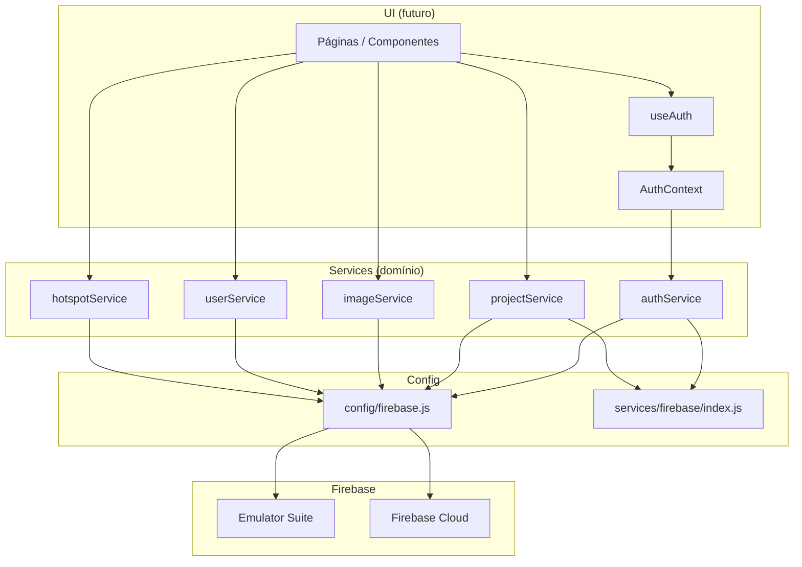

# Firebase Foundation — Sprint 1

Documentação da fundação Firebase do FIVI360: SDK instalado, camadas de serviço criadas, **sem conexão com telas** e **sem remoção de fixtures**.

## Objetivo

Preparar a arquitetura definitiva para integração com **Firebase Cloud** e **Firebase Emulator Suite**, de forma que sprints seguintes implementem Auth, Firestore e Storage sem refatorar a árvore de pastas.

## Restrições desta sprint

| Permitido | Não permitido |
|-----------|---------------|
| Instalar `firebase` e configurar SDK | Conectar `AuthProvider` ao `App` |
| Criar `config`, `services`, `contexts`, `hooks` | Alterar componentes, layout ou rotas |
| `.env.example` e documentação | Remover ou substituir fixtures |
| Esqueletos de API nos services | Integrar dados reais nas páginas |

Fixtures em `src/fixtures/` continuam sendo a fonte de dados das telas até a sprint de integração.

---

## Estrutura

```text
src/
├── config/
│   └── firebase.js                 # Inicialização do SDK + emuladores
├── contexts/
│   └── AuthContext.jsx             # Provider de sessão (esqueleto)
├── hooks/
│   ├── useAuth.js                  # Hook de autenticação
│   └── use-toast.js                # (existente)
├── services/
│   ├── firebase/
│   │   └── index.js                # Utilitários compartilhados Firebase
│   ├── auth/
│   │   └── authService.js          # Authentication
│   ├── users/
│   │   └── userService.js          # Perfil (Firestore users)
│   ├── projects/
│   │   └── projectService.js       # Projetos (Firestore projects)
│   ├── images/
│   │   └── imageService.js         # Imagens + Storage
│   └── hotspots/
│       └── hotspotService.js       # Hotspots do viewer 360°
```

---

## Arquitetura

Camadas separadas por responsabilidade. Páginas e componentes **não** importam o SDK Firebase diretamente — consomem services ou hooks.



### Princípios

1. **`config/firebase.js`** — único ponto de `initializeApp`; exporta `auth`, `db`, `storage`.
2. **Services** — uma pasta por domínio; funções puras/async que encapsulam Firestore, Auth e Storage.
3. **`AuthContext` + `useAuth`** — estado de sessão React; delega operações ao `authService`.
4. **Fixtures** — permanecem até cada domínio ser migrado explicitamente.

---

## Variáveis de ambiente

O projeto usa Create React App (CRaco). Variáveis expostas ao browser devem ter prefixo `REACT_APP_`.

Copie `.env.example` para `.env.local` e preencha com as credenciais do Console Firebase:

```bash
cp .env.example .env.local
```

### Configuração local das Cloud Functions

As Functions usam arquivos **separados** do frontend (pasta `functions/`):

| Arquivo | Papel | Versionado? |
|---------|-------|-------------|
| `functions/.env` | Config não sensível compartilhada | Sim |
| `functions/.env.local` | Overrides locais (Price IDs, `APP_BASE_URL`) | Não |
| `functions/.secret.local` | Secrets para `defineSecret` (Stripe, Resend) | Não |
| `functions/.env.example` | Template documentado | Sim |

```powershell
cd functions
npm install
Copy-Item .env.example .env.local
# Preencher Stripe Price IDs / APP_BASE_URL em .env.local
# Criar .secret.local com STRIPE_* e RESEND_API_KEY de teste
```

Reinicie o emulador após mudanças de ambiente. Detalhes: [RC-FUNCTIONS-ENV-CLEANUP-1.md](./RC-FUNCTIONS-ENV-CLEANUP-1.md) e [stripe-local-setup.md](./stripe-local-setup.md).


| Variável | Descrição |
|----------|-----------|
| `REACT_APP_FIREBASE_API_KEY` | API Key do projeto |
| `REACT_APP_FIREBASE_AUTH_DOMAIN` | Domínio Auth (`projeto.firebaseapp.com`) |
| `REACT_APP_FIREBASE_PROJECT_ID` | ID do projeto |
| `REACT_APP_FIREBASE_STORAGE_BUCKET` | Bucket Storage |
| `REACT_APP_FIREBASE_MESSAGING_SENDER_ID` | Sender ID |
| `REACT_APP_FIREBASE_APP_ID` | App ID |
| `REACT_APP_USE_FIREBASE_EMULATORS` | `true` para apontar ao Emulator Suite |
| `REACT_APP_FIREBASE_AUTH_EMULATOR_URL` | URL do Auth Emulator (padrão `http://127.0.0.1:9099`) |
| `REACT_APP_FIREBASE_FIRESTORE_EMULATOR_HOST` | Host Firestore (padrão `127.0.0.1`) |
| `REACT_APP_FIREBASE_FIRESTORE_EMULATOR_PORT` | Porta Firestore (padrão `8080`) |
| `REACT_APP_FIREBASE_STORAGE_EMULATOR_HOST` | Host Storage (padrão `127.0.0.1`) |
| `REACT_APP_FIREBASE_STORAGE_EMULATOR_PORT` | Porta Storage (padrão `9199`) |

---

## Integração com Firebase Emulator

### Quando usar

- Desenvolvimento local sem consumir quota Cloud
- Testes de Auth, Firestore e Storage com dados efêmeros
- Validação de Security Rules antes do deploy

### Fluxo recomendado

1. Instalar Firebase CLI globalmente (fora deste repo): `npm i -g firebase-tools`
2. Na raiz do monorepo/backend, configurar `firebase.json` com emuladores Auth (9099), Firestore (8080), Storage (9199)
3. Iniciar emuladores: `firebase emulators:start`
4. No frontend, definir em `.env.local`:

   ```env
   REACT_APP_USE_FIREBASE_EMULATORS=true
   ```

5. Reiniciar o dev server (`yarn start`)

`src/config/firebase.js` detecta `REACT_APP_USE_FIREBASE_EMULATORS=true` e chama `connectAuthEmulator`, `connectFirestoreEmulator` e `connectStorageEmulator` **uma única vez** por sessão do browser.

### Cloud vs Emulator

| Modo | `REACT_APP_USE_FIREBASE_EMULATORS` | Destino |
|------|-----------------------------------|---------|
| Cloud | `false` (padrão) | Projeto Firebase configurado nas variáveis |
| Local | `true` | Emulator Suite na máquina de desenvolvimento |

Credenciais Cloud ainda são necessárias no `initializeApp` (valores dummy aceitos pelo Emulator em muitos cenários; use o `projectId` real do emulador).

---

## Responsabilidades por módulo

### `src/config/firebase.js`

- Inicializa Firebase App (singleton)
- Exporta `auth`, `db`, `storage` e `app`
- Conecta emuladores quando habilitado

### `src/services/firebase/index.js`

- Helpers transversais (mapeamento de erros, timestamps Firestore, batch writes)
- **Não** duplica inicialização do SDK

### `src/services/auth/authService.js`

| Função (futura) | Responsabilidade |
|-----------------|------------------|
| `signInWithEmail` | Login e-mail/senha |
| `signUpWithEmail` | Cadastro |
| `signInWithGoogle` | OAuth Google |
| `signOut` | Encerrar sessão |
| `sendPasswordReset` | Recuperação de senha |
| `subscribeAuthState` | Listener para `AuthContext` |

### `src/services/users/userService.js`

- `users/{uid}` — dados privados após cadastro (`displayName`, `email`, `plan`, `billing`, `legalConsent`)
- `publicProfiles/{uid}` — dados públicos do portfólio (`slug`, `portfolioEnabled`, `portfolioAvailable`, perfil do escritório)
- Resolução de slug via `slugs/{slug}`

Ver [public-profile-model.md](./public-profile-model.md).

### `src/services/projects/projectService.js`

- CRUD coleção `projects`
- Filtros por `userId`, visibilidade (`private` \| `shared` \| `public`)
- Compartilhamento por link

### `src/services/images/imageService.js`

- CRUD coleção `images`
- Upload/substituição no Storage (`users/{userId}/images`, paths por projeto)
- Preservar metadados ao substituir arquivo (hotspots, title, visibility, etc.)

### `src/services/hotspots/hotspotService.js`

- CRUD de hotspots por imagem
- Tipos `info` e `scene` (ver `docs/business-rules.md`)
- Preservados ao substituir arquivo de imagem

### `src/contexts/AuthContext.jsx`

- `AuthProvider` com estado `{ user, loading, error, signIn, signOut }`
- Sprint 1: valores estáticos; sem `onAuthStateChanged`

### `src/hooks/useAuth.js`

- Encapsula `useContext(AuthContext)` com validação de provider

---

## Ordem sugerida de implementação (próximas sprints)

1. **Auth** — implementar `authService`, conectar `AuthProvider` ao `App`, rotas protegidas
2. **Users** — criar `users/{uid}` no primeiro login
3. **Projects** — migrar dashboard/projetos dos fixtures
4. **Images** — Storage + Firestore; modal de upload já previsto na UI
5. **Hotspots** — viewer 360° e plano Professional
6. **Security Rules** — isolamento por `userId` no console Firebase

---

## Referências

- [architecture.md](./architecture.md) — modelos, coleções, Storage paths
- [business-rules.md](./business-rules.md) — visibilidade, hotspots, planos
- [roadmap.md](./roadmap.md) — Sprints 1–5

---

## Checklist Sprint 1

- [x] Dependência `firebase` instalada
- [x] `src/config/firebase.js` com env vars e suporte a emuladores
- [x] Services de domínio (auth, users, projects, images, hotspots)
- [x] `AuthContext.jsx` + `useAuth.js` (esqueleto)
- [x] `.env.example`
- [x] Documentação desta fundação
- [ ] Conectar `AuthProvider` ao `App` (próxima sprint)
- [ ] Implementar métodos dos services (próximas sprints)
- [ ] Security Rules iniciais (próximas sprints)
