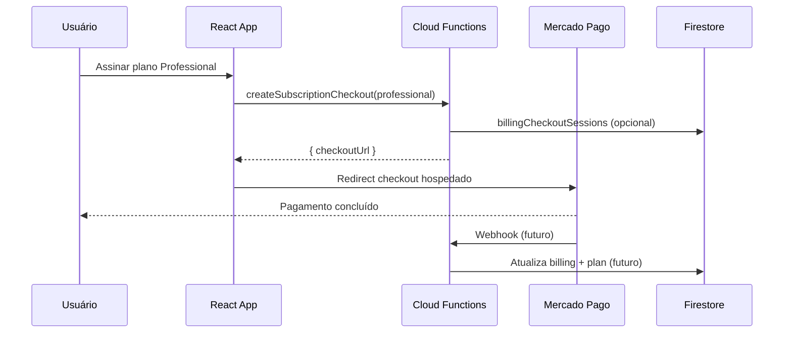

# Billing com Mercado Pago (FIVI360)

Este documento descreve a arquitetura de pagamentos do FIVI360. **Mercado Pago é o único gateway de billing.** Nenhum pagamento real está ativo nesta sprint — apenas a estrutura preparada.

## Decisão de produto

- **Mercado Pago** como único provedor de assinatura recorrente.
- Planos pagos: `professional` e `enterprise`.
- O frontend não expõe SDK ou chaves do Mercado Pago; integrações reais ficam no **backend** (Cloud Functions).

## Configuração (`src/config/billing.js`)

| Constante | Função |
|-----------|--------|
| `BILLING_PROVIDER` | Sempre `"mercado_pago"` |
| `BILLING_STATUS` | Estados de assinatura (`free`, `active`, `past_due`, etc.) |
| `BILLING_PLANS` | Metadados dos planos + env vars MP |
| `getMercadoPagoPlanId()` | Resolve ID do plano MP a partir do `.env` |
| `normalizeBilling()` | Leitura segura do Firestore |

IDs dos planos Mercado Pago ficam **somente no backend** (Cloud Functions). Não use `REACT_APP_*` para billing.

| Variável | Onde definir (dev) | Onde definir (prod) |
|----------|-------------------|---------------------|
| `MP_ACCESS_TOKEN` | `functions/.secret.local` | Firebase Secrets |
| `MP_PLAN_PROFESSIONAL` | `functions/.secret.local` | Firebase Secrets |
| `MP_PLAN_ENTERPRISE` | `functions/.secret.local` | Firebase Secrets |
| `APP_BASE_URL` | `functions/.env` | params / env do Firebase |

> **Nota:** Mercado Pago rejeita Firebase Hosting preview channels como `back_url`. Para testes sandbox, usar domínio live aceito, como `https://fivi360.web.app`. Não use localhost, `127.0.0.1` nem URLs com `--beta-...`.

A callable `createSubscriptionCheckout` declara `secrets: ["MP_PLAN_PROFESSIONAL", "MP_PLAN_ENTERPRISE"]` para que `process.env` receba os IDs no emulador (`.secret.local`) e em produção (Secret Manager). Não chama a API do MP nesta etapa — apenas monta o link de checkout hospedado.

## Modelo Firestore (`users/{uid}.billing`)

```json
{
  "provider": "mercado_pago",
  "customerId": "",
  "subscriptionId": "",
  "planId": "",
  "subscriptionStatus": "free",
  "currentPeriodStart": null,
  "currentPeriodEnd": null,
  "nextInvoiceDate": null,
  "cancelAtPeriodEnd": false,
  "lastInvoiceUrl": "",
  "lastPaymentStatus": "",
  "updatedAt": null
}
```

O campo `users.plan` (`starter` | `professional` | `enterprise`) continua sendo a fonte de **limites** do app. Após billing ativo, webhooks devem manter `plan` e `billing` sincronizados.

## Camada de serviço (`src/services/billing/billingService.js`)

| Função | Comportamento atual | Mercado Pago (futuro) |
|--------|---------------------|------------------------|
| `createCheckoutSession(planId)` | Retorna "Billing ainda não está ativo." | Preapproval / checkout de assinatura recorrente |
| `createBillingPortalSession()` | Idem | Página própria ou link MP de gestão |
| `cancelSubscription()` | Idem | API de cancelamento ao final do período |
| `getBillingSummary()` | Idem | Agrega Firestore + Mercado Pago |
| `getInvoices()` | Idem + `invoices: []` | Lista cobranças MP |

Todas as chamadas devem passar por **Cloud Functions** autenticadas (nunca expor access token no React).

## Fluxo de checkout



## Fluxo de webhook (futuro)

1. Mercado Pago envia evento (pagamento, renovação, falha, cancelamento).
2. Cloud Function valida assinatura do webhook.
3. Resolve `userId` via `customerId` / metadata.
4. Atualiza `users.billing` e, quando aplicável, `users.plan`.

Eventos mínimos a tratar:

- Assinatura criada / ativada → `subscriptionStatus: active`, `plan` atualizado
- Renovação → `currentPeriodEnd`, `nextInvoiceDate`
- Falha de pagamento → `past_due` ou `unpaid`
- Cancelamento → `canceled`, `cancelAtPeriodEnd`

## Atualização de plano

1. Usuário escolhe novo plano em `/plan` (modal de upgrade).
2. Cloud Function cria nova sessão de checkout ou altera assinatura existente no MP.
3. Webhook confirma mudança e atualiza `billing.planId` + `users.plan`.

Downgrade e cancelamento seguem a mesma regra: **webhook como fonte de verdade**.

## Integração futura com Resend

E-mails transacionais de billing (confirmação de assinatura, falha de pagamento, cancelamento) serão enviados via **Resend**, já usado no projeto para verificação de e-mail.

Fluxo previsto:

1. Webhook MP processa evento de billing.
2. Cloud Function atualiza Firestore.
3. Enfileira e-mail em `emailQueue` (tipo `billing_*`) ou chama Resend diretamente.
4. Templates em `functions/src/emailTemplates/` (a criar na sprint de billing).

Ver também `docs/resend-email-plan.md`.

## UI (esta sprint)

- Textos genéricos: **Assinar plano**, **Gerenciar assinatura**, **Histórico de cobrança**.
- Sem menção a gateways de pagamento nas telas.
- `/plan`: central de assinatura (consumo, gerenciar, histórico).
- Modal: "Escolha seu plano" + aviso "Pagamentos serão ativados em breve."
- Landing: CTAs levam a `/register?plan=…` ou `/plan?upgrade=…`.

## Riscos e próximos passos

| Risco | Mitigação |
|-------|-----------|
| Dessincronia `plan` vs `billing` | Webhook como fonte de verdade; job de reconciliação |
| PCI / segredos no client | Apenas backend chama APIs do Mercado Pago |

**Próximos passos (fora desta sprint):**

1. Cloud Functions para checkout, portal e webhooks MP.
2. Ativar `billingService` chamando Functions (não SDK no browser).
3. Preencher `.env` com IDs reais dos planos MP.
4. Templates Resend para eventos de billing.
5. Testes E2E do fluxo landing → registro → `/plan?upgrade=`.

## Cloud Function `getMercadoPagoStatus`

Callable function (`onCall`) que valida o `MP_ACCESS_TOKEN` contra a API do Mercado Pago (`GET /users/me`). Retorna `{ connected: false }` ou `{ connected: true, environment: "sandbox" | "production" }`.

Implementação: `functions/src/getMercadoPagoStatus.js`  
Cliente frontend: `src/services/billing/mercadoPagoStatusService.js`

### Como testar (callable)

**Callable functions não devem ser testadas abrindo a URL no navegador.** Um GET direto em  
`http://127.0.0.1:5001/.../getMercadoPagoStatus` retorna `"Request has invalid method. GET"` — isso é esperado.

Formas corretas de testar:

1. **Frontend com `httpsCallable`** (recomendado em dev local):
   - Defina `REACT_APP_USE_FIREBASE_EMULATORS=true` em `.env.local`
   - Inicie `firebase emulators:start` (Functions na porta 5001)
   - Inicie o app (`yarn start`)
   - Use o painel **MP Status (dev)** no canto inferior direito, ou chame:

   ```js
   import { getMercadoPagoStatus } from "@/services/billing/mercadoPagoStatusService";
   const status = await getMercadoPagoStatus();
   ```

2. **Script com Firebase SDK** — mesmo padrão de `httpsCallable(functions, "getMercadoPagoStatus")` com `connectFunctionsEmulator` apontando para `127.0.0.1:5001`.

3. **Emulator UI** — use a aba Functions para inspecionar logs após uma chamada via SDK; não use o link HTTP como teste de callable.

Configure os segredos locais em `functions/.secret.local`:

```env
MP_ACCESS_TOKEN=TEST-...
MP_PLAN_PROFESSIONAL=<id do plano Professional no MP>
MP_PLAN_ENTERPRISE=<id do plano Enterprise no MP>
```

## Cloud Function `createSubscriptionCheckout`

Callable (`onCall`) que retorna o **checkout hospedado** do Mercado Pago a partir do `init_point` do plano. **Não** chama `POST /preapproval` — o usuário conclui o pagamento na página do MP.

Implementação: `functions/src/createSubscriptionCheckout.js`

Mapeamento de planos (`functions/src/config/billing.js`):

| `planId` (frontend) | Env backend |
|---------------------|-------------|
| `professional` | `MP_PLAN_PROFESSIONAL` |
| `enterprise` | `MP_PLAN_ENTERPRISE` |

URL gerada:

```
https://www.mercadopago.com.br/subscriptions/checkout?preapproval_plan_id={mpPlanId}
```

Retorno:

```json
{
  "checkoutUrl": "...",
  "provider": "mercado_pago",
  "planId": "professional",
  "mpPlanId": "..."
}
```

Validações: usuário autenticado, `planId` permitido, plano MP configurado, sem assinatura ativa em `subscriptions/{userId}`.

Antes de redirecionar, a function grava `billingCheckoutSessions/{sessionId}` com `userId`, `planId`, `mpPlanId`, `provider`, `status: "created"` e `createdAt`. Isso prepara o vínculo assinatura ↔ usuário no webhook.

**Não altera** `users.plan`, `subscriptions` nem billing do usuário nesta etapa.

O frontend envia apenas `{ planId }` via `subscriptionCheckoutService.js` e redireciona para `checkoutUrl`.

### Webhook (pendência: vincular assinatura ao usuário)

O webhook será responsável por:

1. Receber a assinatura criada no Mercado Pago.
2. Identificar o plano pelo `preapproval_plan_id`.
3. Identificar o usuário.

Como o checkout via `init_point` do plano **não carrega metadata do usuário** no MP, ainda precisamos decidir o mecanismo de vínculo:

| Opção | Prós / contras |
|-------|----------------|
| `payer_email` no webhook | Simples se o e-mail do comprador = e-mail do Firebase Auth |
| `billingCheckoutSessions` | Sessão interna criada antes do redirect; webhook cruza por sessão/plano/timestamp |
| `external_reference` no link | Depende de o MP aceitar parâmetros extras na URL do plano |

Por enquanto, `billingCheckoutSessions` é a pista preferida; `payer_email` serve como fallback.

## O que não foi implementado nesta sprint

- Mercado Pago SDK no frontend
- Checkout real, webhooks, Cloud Functions de billing
- Cancelamento, downgrade ou troca de plano reais
- E-mails de cobrança via Resend
