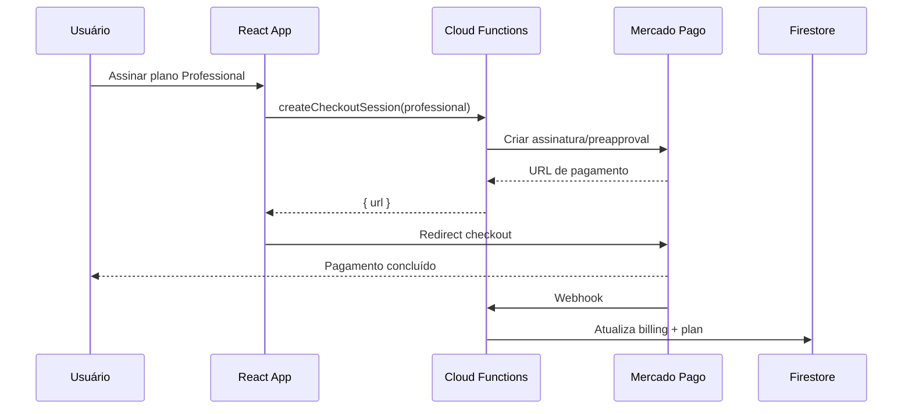

# Billing com Mercado Pago (FIVI360)

Este documento descreve a arquitetura de pagamentos do FIVI360. **Mercado Pago é o único gateway de billing.** Nenhum pagamento real está ativo nesta sprint — apenas a estrutura preparada.

## Decisão de produto

- **Mercado Pago** como único provedor de assinatura recorrente.
- Planos pagos: `professional` e `enterprise`.
- O frontend não expõe SDK ou chaves do Mercado Pago; integrações reais ficam no **backend** (Cloud Functions).

## Configuração (`src/config/billing.js`)

| Constante | Função |
|-----------|--------|
| `BILLING_PROVIDER` | Sempre `"mercado_pago"` |
| `BILLING_STATUS` | Estados de assinatura (`free`, `active`, `past_due`, etc.) |
| `BILLING_PLANS` | Metadados dos planos + env vars MP |
| `getMercadoPagoPlanId()` | Resolve ID do plano MP a partir do `.env` |
| `normalizeBilling()` | Leitura segura do Firestore |

Variáveis de ambiente (ver `.env.example`):

- `REACT_APP_MP_PLAN_PROFESSIONAL`
- `REACT_APP_MP_PLAN_ENTERPRISE`

## Modelo Firestore (`users/{uid}.billing`)

```json
{
  "provider": "mercado_pago",
  "customerId": "",
  "subscriptionId": "",
  "planId": "",
  "subscriptionStatus": "free",
  "currentPeriodStart": null,
  "currentPeriodEnd": null,
  "nextInvoiceDate": null,
  "cancelAtPeriodEnd": false,
  "lastInvoiceUrl": "",
  "lastPaymentStatus": "",
  "updatedAt": null
}
```

O campo `users.plan` (`starter` | `professional` | `enterprise`) continua sendo a fonte de **limites** do app. Após billing ativo, webhooks devem manter `plan` e `billing` sincronizados.

## Camada de serviço (`src/services/billing/billingService.js`)

| Função | Comportamento atual | Mercado Pago (futuro) |
|--------|---------------------|------------------------|
| `createCheckoutSession(planId)` | Retorna "Billing ainda não está ativo." | Preapproval / checkout de assinatura recorrente |
| `createBillingPortalSession()` | Idem | Página própria ou link MP de gestão |
| `cancelSubscription()` | Idem | API de cancelamento ao final do período |
| `getBillingSummary()` | Idem | Agrega Firestore + Mercado Pago |
| `getInvoices()` | Idem + `invoices: []` | Lista cobranças MP |

Todas as chamadas devem passar por **Cloud Functions** autenticadas (nunca expor access token no React).

## Fluxo de checkout (futuro)



## Fluxo de webhook (futuro)

1. Mercado Pago envia evento (pagamento, renovação, falha, cancelamento).
2. Cloud Function valida assinatura do webhook.
3. Resolve `userId` via `customerId` / metadata.
4. Atualiza `users.billing` e, quando aplicável, `users.plan`.

Eventos mínimos a tratar:

- Assinatura criada / ativada → `subscriptionStatus: active`, `plan` atualizado
- Renovação → `currentPeriodEnd`, `nextInvoiceDate`
- Falha de pagamento → `past_due` ou `unpaid`
- Cancelamento → `canceled`, `cancelAtPeriodEnd`

## Atualização de plano

1. Usuário escolhe novo plano em `/plan` (modal de upgrade).
2. Cloud Function cria nova sessão de checkout ou altera assinatura existente no MP.
3. Webhook confirma mudança e atualiza `billing.planId` + `users.plan`.

Downgrade e cancelamento seguem a mesma regra: **webhook como fonte de verdade**.

## Integração futura com Resend

E-mails transacionais de billing (confirmação de assinatura, falha de pagamento, cancelamento) serão enviados via **Resend**, já usado no projeto para verificação de e-mail.

Fluxo previsto:

1. Webhook MP processa evento de billing.
2. Cloud Function atualiza Firestore.
3. Enfileira e-mail em `emailQueue` (tipo `billing_*`) ou chama Resend diretamente.
4. Templates em `functions/src/emailTemplates/` (a criar na sprint de billing).

Ver também `docs/resend-email-plan.md`.

## UI (esta sprint)

- Textos genéricos: **Assinar plano**, **Gerenciar assinatura**, **Histórico de cobrança**.
- Sem menção a gateways de pagamento nas telas.
- `/plan`: central de assinatura (consumo, gerenciar, histórico).
- Modal: "Escolha seu plano" + aviso "Pagamentos serão ativados em breve."
- Landing: CTAs levam a `/register?plan=…` ou `/plan?upgrade=…`.

## Riscos e próximos passos

| Risco | Mitigação |
|-------|-----------|
| Dessincronia `plan` vs `billing` | Webhook como fonte de verdade; job de reconciliação |
| PCI / segredos no client | Apenas backend chama APIs do Mercado Pago |

**Próximos passos (fora desta sprint):**

1. Cloud Functions para checkout, portal e webhooks MP.
2. Ativar `billingService` chamando Functions (não SDK no browser).
3. Preencher `.env` com IDs reais dos planos MP.
4. Templates Resend para eventos de billing.
5. Testes E2E do fluxo landing → registro → `/plan?upgrade=`.

## O que não foi implementado nesta sprint

- Mercado Pago SDK no frontend
- Checkout real, webhooks, Cloud Functions de billing
- Cancelamento, downgrade ou troca de plano reais
- E-mails de cobrança via Resend
