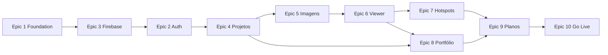

# FIVI360 — Plano Oficial de Reconstrução v2

> **Nota histórica (RC-CLEANUP-LEGACY-1):** itens que citam Mercado Pago neste plano
> estão **descontinuados**. Billing ativo = Stripe apenas; Beta sem migração de schemas antigos.

**Documento:** Plano executivo para transformar o protótipo visual em MVP funcional  
**Versão:** 2.0  
**Data:** 31/05/2026  
**Escopo:** Frontend React + integração Firebase  
**Tipo:** Somente documentação — nenhum código alterado  

**Fontes:**

| Documento | Uso |
|-----------|-----|
| `product.md` | Escopo do MVP e funcionalidades |
| `business-rules.md` | Visibilidade, upload, planos, mobile |
| `architecture.md` | Stack, modelos, rotas, Storage |
| `roadmap.md` | Sequência de sprints (1–10) |
| `design_guidelines.json` | Identidade visual e `data-testid` |
| `design-system.md` | Tokens e padrões de UI |
| `audit-report.md` | Gap analysis, estado atual, riscos |
| `audit-componentization.md` | *Arquivo não encontrado — conteúdo derivado da seção «Componentes Reutilizáveis» de `audit-report.md`* |
| `cursor-rules.md` | Princípios de evolução incremental |

---

# Visão Geral

O **FIVI360** é uma plataforma SaaS para arquitetos, designers de interiores, incorporadoras e profissionais criativos apresentarem projetos por meio de imagens panorâmicas 360°. A solução transforma imagens estáticas em experiências imersivas com navegação intuitiva, compartilhamento por link e portfólio público.

**Público-alvo:** arquitetos, designers, escritórios, construtoras, incorporadoras e visualizadores arquitetônicos.

**Objetivos do MVP:**

| Área | Entregas |
|------|----------|
| Autenticação | Cadastro, login, logout, recuperação de senha, login Google |
| Dashboard | Resumo de projetos, imagens, links e armazenamento; listas recentes |
| Projetos | CRUD, `clientName`, visibilidade `private` / `shared` / `public`, compartilhamento |
| Imagens | Upload com modal de preview, renomear, substituir (preservar metadados), excluir, compartilhar |
| Viewer | Pannellum 360°, fullscreen/zoom no desktop; regras mobile específicas |
| Hotspots | Tipos `info` e `scene`; navegação entre ambientes |
| Portfólio | URL `/f/:publicSlug` com projetos `public` |
| Planos | Starter e Professional com limites de features |
| Go Live | Landing, páginas legais, SEO, segurança Firebase, testes, publicação |

**Stack alvo:** React + Vite (ou CRA atual) + React Router + Tailwind + shadcn/ui no frontend; Firebase Auth, Firestore e Storage no backend (`architecture.md`).

---

# Estado Atual

O repositório contém um **protótipo visual** (nível 1 de 5) gerado pelo Emergent. A identidade dark premium está madura; a lógica de negócio e persistência não existem.

| Dimensão | Estado |
|----------|--------|
| UI / Design | Parcial — coerente com `design_guidelines.json` |
| Páginas | 9 wireframes (`Dashboard`, `Projects`, `ProjectDetail`, `NewProject`, `Viewer`, `Settings`, `Plan`, `PublicProject`, `PublicImage`) |
| Layout | `Layout.js` — sidebar responsiva funcional |
| Rotas | 10 declaradas; auth, landing, portfólio `/f/:slug`, legal e 404 ausentes |
| Dados | 100% mocks inline; params de URL (`:id`, `:imageId`) ignorados |
| Viewer | Simulação CSS (imagem estática Unsplash), não Pannellum |
| Hotspots | Inexistentes |
| Firebase | Não integrado |
| shadcn | 46 componentes instalados, não usados nas páginas |
| Testes | Inexistentes |

**O que já existe visualmente e deve ser preservado:**

- Sidebar autenticada (`Layout.js`) — drawer mobile, nav ativa branca
- Padrões de cards: `bg-zinc-900/50`, `border-zinc-800`, `rounded-2xl`
- CTAs brancos arredondados, inputs zinc, tipografia Outfit/Manrope
- Overlays do viewer (adaptar ao Pannellum)
- Utilitários `App.css`: `.card-hover`, `.btn-scale`, `.fade-in`, `.image-zoom-hover`
- ~70 `data-testid` — base para E2E
- Grids responsivos (`gap-6`, breakpoints consistentes)

**Divergências críticas em relação ao produto:**

- Visibilidade na UI: «Privado / Não listado / Público» vs `private` / `shared` / `public`
- Planos na UI: Gratuito / Profissional / Enterprise vs Starter / Professional
- Rota share de imagem: `/share/image/:projectId/:imageId` vs spec `/share/image/:imageId`
- Campo `clientName` ausente nos formulários
- Modais de upload, share e exclusão inexistentes

---

# Princípios da Reconstrução

1. **Preservar design existente** — O protótipo é a referência visual oficial. Extrair componentes (`PageHeader`, `StatCard`, `ProjectCard`, etc.) sem alterar a identidade definida em `design_guidelines.json` e `design-system.md`.

2. **Substituir mocks por dados reais** — Eliminar arrays `mock*` inline; conectar Firestore e Storage via `services/` e hooks. Nunca gerar mocks em produção (`cursor-rules.md`).

3. **Evitar reescrita desnecessária** — Reutilizar layouts, padrões de página e `data-testid`. Unificar `Viewer.js` e `PublicImage.js` em um componente, não reescrever do zero sem necessidade.

4. **Evolução incremental** — Uma feature por vez; analisar impacto antes de alterar código funcional. Se houver dúvida entre criar algo novo ou preservar o que funciona, preservar (`cursor-rules.md`).

**Prioridades técnicas:** estabilidade → segurança → responsividade → performance → estética.

---

# Épicos

| Épico | Nome | Resumo |
|-------|------|--------|
| **Epic 1** | Foundation | Estrutura de pastas, design system unificado, componentização, layouts |
| **Epic 2** | Auth | Login, cadastro, recuperação, Google, guards de rota |
| **Epic 3** | Firebase | Projeto, Auth/Firestore/Storage, serviços, regras de segurança base |
| **Epic 4** | Projetos | CRUD, `clientName`, visibilidade, capa, compartilhamento |
| **Epic 5** | Imagens | Upload modal, validação, renomear, substituir, excluir, share |
| **Epic 6** | Viewer | Pannellum, desktop fullscreen/zoom, regras mobile |
| **Epic 7** | Hotspots | info + scene, render no viewer, editor, limites por plano |
| **Epic 8** | Portfólio Público | `/f/:publicSlug`, share público, mobile capa→viewer |
| **Epic 9** | Planos | Starter/Professional, consumo, enforcement de limites |
| **Epic 10** | Go Live | Landing, legal, SEO, testes, limpeza Emergent, deploy |

Alinhamento com `roadmap.md`: Sprints 1–10 mapeiam aos épicos 2–10; Epic 1 + 3 precedem o trabalho funcional.

---

# Backlog

## Epic 1 — Foundation

**Objetivo:** Estabelecer infraestrutura frontend, extrair componentes reutilizáveis do protótipo e unificar o design system antes de conectar dados.

**Dependências:** Nenhuma (épico inicial).

**Tarefas:**

- Criar estrutura `src/services`, `src/contexts`, `src/hooks`, `src/utils` conforme `architecture.md`
- Extrair `PageHeader`, `StatCard`, `ProjectCard`, `ImageCard`, `PricingCard`, `FormSection`, `VisibilitySelector`, `BackLink`
- Refatorar `Layout.js` → `AuthenticatedLayout`; criar `PublicLayout` e `ViewerLayout`
- Integrar shadcn de fato: `Button`, `Input`, `Textarea`, `Dialog`, `DropdownMenu`, `AlertDialog`, `RadioGroup`, Toaster
- Normalizar enum `private` | `shared` | `public` + labels PT-BR
- Contratos de dados (JSDoc): `User`, `Project`, `Image`, `Hotspot`
- Estados globais: `LoadingSpinner`, `EmptyState`, `ErrorBoundary`
- Página 404 (`*`)
- Isolar scripts Emergent para ambiente de desenvolvimento apenas

**Critérios de aceite:**

- [ ] Pastas e convenções de import alinhadas a `architecture.md`
- [ ] ≥3 páginas autenticadas usam `PageHeader` e cards extraídos sem regressão visual
- [ ] Visibilidade exibida e editada apenas com valores `private` / `shared` / `public`
- [ ] shadcn `Button` e `Input` substituem CTAs/inputs duplicados nas novas telas
- [ ] Toaster global montado em `App.js`
- [ ] Layouts autenticado, público e viewer disponíveis e documentados
- [ ] Nenhuma alteração de cor/tipografia fora de `design_guidelines.json`

---

## Epic 2 — Auth

**Objetivo:** Usuários podem se cadastrar, autenticar e sair; rotas privadas ficam protegidas.

**Dependências:** Epic 1 (layouts, forms shadcn); Epic 3 parcial (Firebase Auth configurado).

**Tarefas:**

- Páginas `/login`, `/register`, `/forgot-password`
- `AuthContext` + hook `useAuth`
- `authService`: email/senha, Google, logout, reset password
- `userService`: criar documento `users` no cadastro
- `ProtectedRoute` e `PublicOnlyRoute`
- Logout no menu da sidebar
- Formulários com react-hook-form + zod
- Redirect `/`: autenticado → dashboard; não autenticado → login (landing na Epic 10)

**Critérios de aceite:**

- [ ] `/dashboard`, `/projects`, `/settings` e `/plan` inacessíveis sem sessão
- [ ] Cadastro cria registro em `users` com campos mínimos (`id`, `name`, `email`, `plan`, `createdAt`)
- [ ] Login Google funciona e reutiliza ou cria user doc
- [ ] Recuperação de senha envia e-mail via Firebase
- [ ] Logout limpa sessão e redireciona para `/login`
- [ ] Formulários de auth seguem tema dark e `data-testid` em CTAs principais

---

## Epic 3 — Firebase

**Objetivo:** Camada de persistência e autenticação operacional, com serviços e regras de segurança auditáveis.

**Dependências:** Epic 1 (estrutura `services/`).

**Tarefas:**

- Criar projeto Firebase; documentar variáveis de ambiente (`.env.example`)
- Módulo `firebase.js`: Auth, Firestore, Storage
- `projectService`, `imageService`, `storageService`, `hotspotService`, `userService`
- Helpers: timestamps, tratamento de erros, paths Storage (`users/{userId}/images`, `users/{userId}/projects/{projectId}`)
- Firestore Security Rules — `users`, `projects`, `images` (owner `userId`)
- Storage Security Rules — paths por `userId`
- Coleção/subcoleção de hotspots conforme modelo em `architecture.md`

**Critérios de aceite:**

- [ ] Auth, Firestore e Storage acessíveis por um único módulo
- [ ] CRUD de projeto e imagem funciona via serviços (testável manualmente ou E2E)
- [ ] Upload grava arquivo no path correto e URLs em `previewUrl` / `originalUrl`
- [ ] Usuário A não lê/escreve dados do usuário B (rules validadas no console Firebase)
- [ ] Variáveis sensíveis não commitadas no repositório

---

## Epic 4 — Projetos

**Objetivo:** Gestão completa de projetos com regras de negócio e compartilhamento.

**Dependências:** Epic 2 (auth), Epic 3 (Firestore + `projectService`), Epic 1 (componentes e layouts).

**Tarefas:**

- Listagem `/projects` com dados reais (`ProjectCard`)
- Criação `/projects/new`: title, description, `clientName`, visibility, capa opcional
- Detalhe `/projects/:id` respeitando param — 404 se inexistente
- Editar projeto (inline ou rota dedicada)
- Excluir com `AlertDialog`; definir comportamento de imagens órfãs
- Upload de capa → `coverImage`
- Modal compartilhar → link `/share/project/:projectId`
- `DropdownMenu` nas ações de card (ver, editar, compartilhar, excluir)
- Hooks `useProjects`, `useProject(id)`
- Remover mocks de `Projects.js`, `NewProject.js`, `ProjectDetail.js`

**Critérios de aceite:**

- [ ] `:id` na URL altera o projeto exibido
- [ ] `clientName` obrigatório na criação/edição
- [ ] Visibilidade persistida como `private` | `shared` | `public`
- [ ] Projeto pode existir sem imagens
- [ ] Link de share copiável; projeto `private` não acessível publicamente
- [ ] Dashboard e Projects não contêm arrays mock

---

## Epic 5 — Imagens

**Objetivo:** Pipeline completo de imagens panorâmicas com upload guiado e substituição sem perda de metadados.

**Dependências:** Epic 3 (Storage + Firestore); Epic 4 (`projectId` opcional).

**Tarefas:**

- `UploadImageDialog`: selecionar → preview → nome → confirmar → loading
- Validar JPG, JPEG, PNG; rejeitar HEIC, TIFF, BMP
- Aviso se resolução abaixo do recomendado (`business-rules.md`)
- Galeria grid/lista em `ProjectDetail` com dados reais
- Renomear (`title`), excluir (Firestore + Storage), compartilhar (`/share/image/:imageId`)
- Substituir arquivo preservando title, description, hotspots, visibility, projectId, userId
- Suportar `projectId = null` (imagem sem projeto)
- Hook `useImages(projectId?)`
- Remover mocks de galeria e viewer placeholder

**Critérios de aceite:**

- [ ] Fluxo de upload em 5 passos conforme `product.md`
- [ ] Após substituir, hotspots e metadados permanecem; URLs e dimensões atualizam
- [ ] Formato inválido bloqueado com mensagem clara
- [ ] Exclusão remove objeto no Storage e documento no Firestore
- [ ] Share de imagem usa rota `/share/image/:imageId` (sem `:projectId`)

---

## Epic 6 — Viewer

**Objetivo:** Visualização 360° real com Pannellum e comportamento correto em desktop e mobile.

**Dependências:** Epic 5 (imagens com `originalUrl` equirectangular).

**Tarefas:**

- Instalar e integrar Pannellum
- Componente `PanoramaViewer` + `ViewerToolbar`
- Rota `/viewer/:projectId/:imageId` carregando imagem correta
- Desktop: fullscreen e zoom
- Mobile: ocultar controles de zoom/fullscreen; rodapé com nome do projeto e da imagem
- Unificar `Viewer.js` e `PublicImage.js` no mesmo núcleo
- Loading enquanto panorama carrega
- Página `/share/image/:imageId` sem login para `shared` e `public`

**Critérios de aceite:**

- [ ] Panorama navegável por arraste (não imagem estática com CSS scale)
- [ ] Params `projectId` e `imageId` determinam a cena exibida
- [ ] Em viewport mobile, zoom/fullscreen não aparecem; rodapé exibe projeto + imagem
- [ ] Imagem `private` não abre em rotas públicas
- [ ] Overlays mantêm identidade visual (backdrop-blur, bordas sutis)

---

## Epic 7 — Hotspots

**Objetivo:** Interatividade no viewer — informações e navegação entre cenas.

**Dependências:** Epic 6 (Pannellum); Epic 3 (`hotspotService`); Epic 9 parcial para enforcement Starter.

**Tarefas:**

- Modelo `Hotspot`: id, imageId, type (`info` | `scene`), pitch, yaw, title, description, targetImageId
- Renderizar marcadores no Pannellum
- Tipo `info`: popover/painel com conteúdo
- Tipo `scene`: navega para `targetImageId` no viewer
- Editor: posicionar no panorama, CRUD de hotspots
- Bloquear criação/edição no plano Starter
- Hook `useHotspots(imageId)`

**Critérios de aceite:**

- [ ] Hotspot `info` exibe title e description
- [ ] Hotspot `scene` carrega outra imagem sem sair do viewer
- [ ] Hotspots persistem após substituir imagem (mesmo `imageId`)
- [ ] Usuário Starter não cria hotspots (UI + validação server-side/rules)
- [ ] Coordenadas pitch/yaw estáveis após reload

---

## Epic 8 — Portfólio Público

**Objetivo:** Presença pública do escritório via slug e páginas de compartilhamento sem login.

**Dependências:** Epic 4 (projetos `public`); Epic 6 (viewer); Epic 3; Settings com `publicSlug` (Epic 9 ou neste épico).

**Tarefas:**

- Rota `/f/:publicSlug` listando projetos `visibility: public`
- Campo `publicSlug` em Settings — único, obrigatório para portfólio
- Flag `portfolioEnabled` no user
- Refatorar `/share/project/:projectId` com `PublicLayout` e dados reais
- Validação: apenas `shared` ou `public` acessíveis sem auth
- Mobile: toque na capa do projeto público abre primeira imagem no viewer
- Bloquear portfólio no plano Starter
- Footer «Powered by FIVI360» em páginas públicas

**Critérios de aceite:**

- [ ] Dois usuários não podem ter o mesmo `publicSlug`
- [ ] Portfólio exibe somente projetos `public` do dono do slug
- [ ] `/share/project/:projectId` funciona sem login para shared/public
- [ ] No mobile, capa do projeto compartilhado abre a primeira imagem
- [ ] Páginas públicas sem sidebar administrativa

---

## Epic 9 — Planos

**Objetivo:** Planos Starter e Professional com limites refletidos na UI e no backend.

**Dependências:** Epic 4, 5, 7, 8 (features a limitar).

**Tarefas:**

- Alinhar `/plan` a Starter e Professional (remover Gratuito/Enterprise do protótipo)
- Campo `plan` no documento `users` (default `starter`)
- Exibir consumo real: imagens, armazenamento, features
- `usePlanLimits`: verificar antes de upload, hotspots, portfólio
- Bloquear upload ao atingir limite de imagens
- Settings completo: perfil, `companyName`, `companyLogo`, `publicSlug`, alterar senha
- Barras de progresso com shadcn `Progress`

**Critérios de aceite:**

- [ ] UI de planos e features alinhada a `business-rules.md`
- [ ] Starter: sem hotspots, sem portfólio público, limite de imagens enforced
- [ ] Professional: hotspots, portfólio e limite maior habilitados
- [ ] Consumo exibido corresponde aos dados Firestore/Storage do usuário
- [ ] Upgrade manual de plano possível até integração Mercado Pago (pós-MVP)

---

## Epic 10 — Go Live

**Objetivo:** Publicar MVP seguro, legal e testado em produção.

**Dependências:** Épicos 1–9 concluídos.

**Tarefas:**

- Landing `/`: Hero, Recursos, Como Funciona, Preços, FAQ
- Páginas `/termos`, `/privacidade`, `/ajuda`
- SEO: title «FIVI360», meta description, `lang="pt-BR"`
- Remover badge Emergent, PostHog, `emergent-main.js`, visual-edits em produção
- Favicon, manifest, assets locais
- Testes E2E nos fluxos críticos (auth, CRUD projeto, upload, viewer) usando `data-testid`
- Revisão final Firestore + Storage rules
- Deploy (Firebase Hosting ou equivalente)
- Redirect `/` definitivo: não autenticado → landing; autenticado → dashboard

**Critérios de aceite:**

- [ ] URL de produção acessível com HTTPS
- [ ] Nenhum script de plataforma Emergent em build de produção
- [ ] Páginas legais publicadas e linkadas no rodapé
- [ ] Testes E2E críticos passando no CI ou manual documentado
- [ ] Security rules auditadas e aprovadas
- [ ] Checklist de Go Live (seção abaixo) 100% marcado

---

# Ordem de Implementação

Sequência recomendada — cada item pressupõe os anteriores concluídos, salvo itens marcados com ⚡ (podem paralelizar dentro do mesmo épico).

1. **Epic 1 — Foundation:** estrutura de pastas, extração de componentes, layouts, shadcn, enum de visibilidade, 404  
2. **Epic 3 — Firebase:** projeto, `firebase.js`, serviços base, security rules iniciais  
3. **Epic 2 — Auth:** telas, context, guards, user doc no cadastro  
4. **Epic 4 — Projetos:** CRUD, `clientName`, capa, share, remoção de mocks  
5. **Epic 5 — Imagens:** upload modal, validação, substituir, galeria real  
6. **Epic 6 — Viewer:** Pannellum, rotas dinâmicas, regras mobile, unificação Viewer/PublicImage  
7. **Epic 7 — Hotspots:** render, info/scene, editor  
8. **Epic 8 — Portfólio Público:** `publicSlug`, `/f/:slug`, share project, mobile capa  
9. **Epic 9 — Planos:** Starter/Professional, consumo, enforcement  
10. **Epic 10 — Go Live:** landing, legal, SEO, testes, limpeza Emergent, deploy  

**Paralelização sugerida:**

- ⚡ Epic 1 (componentes visuais) enquanto Epic 3 (config Firebase) inicia  
- ⚡ Epic 8 (share project) pode iniciar logo após Epic 6, antes do portfólio `/f/:slug`  
- Settings (`publicSlug`) pode avançar junto com Epic 8  

---

# Riscos

Principais riscos identificados em `audit-report.md` e mitigações associadas.

| Risco | Severidade | Descrição | Mitigação |
|-------|------------|-----------|-----------|
| Protótipo tratado como funcional | Crítica | Submits fake e mocks dão falsa sensação de pronto | Este plano; code review focado em remoção de mocks |
| Viewer não 360° | Crítica | Core do produto inexistente | Epic 6 obrigatório com Pannellum antes de go-live |
| Params de URL ignorados | Alta | `:id` e `:imageId` não alteram conteúdo hoje | Critérios P0 nos épicos 4, 5 e 6 |
| Autenticação ausente | Crítica | Rotas «privadas» abertas | Epic 2 antes de dados reais em produção |
| Security rules incompletas | Crítica | Vazamento de dados entre usuários | Epic 3 + revisão final Epic 10 |
| Dois design systems | Média | Tailwind inline vs shadcn não usado | Epic 1 unifica componentes |
| Divergência de visibilidade e planos | Alta | UI não reflete `business-rules.md` | Epic 1 (enum) + Epic 9 (UI planos) |
| Modais inexistentes | Alta | Upload e share bloqueados | Epic 5 e 4 com shadcn Dialog |
| Emergent/PostHog em produção | Média | Scripts de terceiros no HTML | Epic 1 isolar; Epic 10 remover |
| Duplicação Viewer/PublicImage | Média | Manutenção dobrada | Epic 6 — `PanoramaViewer` único |
| CRA em manutenção | Baixa | React 19 + CRA pode gerar fricção | Documentar migração Vite pós-MVP |
| Conteúdo legal ausente | Alta | LGPD e termos | Iniciar redação na Epic 9; publicar na Epic 10 |
| Imagens Unsplash em QA | Média | Não são panorâmicas reais | Assets equirectangular de teste na Epic 5 |
| Stats mock inconsistentes | Baixa | Dashboard vs Plan | Resolver ao conectar Firebase (épicos 2, 9) |

---

# Critérios de Go Live

Checklist final antes da publicação. Todos os itens devem estar marcados.

## Produto e negócio

- [ ] MVP de `product.md` implementado (auth, dashboard, projetos, imagens, viewer, hotspots, portfólio, planos)
- [ ] Regras de `business-rules.md` validadas (visibilidade, upload, substituir imagem, mobile, planos)
- [ ] Rotas de `architecture.md` implementadas e funcionais
- [ ] Zero arrays `mock*` ou dados hardcoded em páginas de produção

## Técnico

- [ ] Firebase Auth, Firestore e Storage em produção com rules auditadas
- [ ] Pannellum em todas as rotas de visualização 360°
- [ ] Params dinâmicos (`:id`, `:imageId`, `:publicSlug`, `:projectId`) funcionais
- [ ] Rotas `/share/project/:projectId` e `/share/image/:imageId` sem login para shared/public
- [ ] Portfólio em `/f/:publicSlug` com slug único
- [ ] Plano Starter bloqueia hotspots e portfólio; limites de imagens enforced

## UX e design

- [ ] Identidade conforme `design_guidelines.json` e `design-system.md`
- [ ] Responsividade validada (sidebar, grids, viewer mobile)
- [ ] Viewer mobile sem zoom/fullscreen; rodapé com projeto e imagem
- [ ] Páginas públicas limpas (sem sidebar admin)

## Qualidade e compliance

- [ ] Testes E2E dos fluxos críticos passando
- [ ] `data-testid` preservados nos fluxos principais
- [ ] Páginas `/termos`, `/privacidade` e `/ajuda` publicadas
- [ ] LGPD refletida na política de privacidade
- [ ] Landing page com SEO básico (title, description, `lang="pt-BR"`)

## Produção

- [ ] Scripts Emergent, PostHog e badge removidos do build de produção
- [ ] Favicon e manifest configurados
- [ ] Deploy estável com HTTPS
- [ ] Variáveis de ambiente de produção documentadas e seguras
- [ ] README do projeto atualizado (não genérico CRA)

## Métricas de sucesso do MVP

| Métrica | Meta |
|---------|------|
| Rotas vs `architecture.md` | 100% |
| Páginas sem mocks | 100% |
| Params dinâmicos | 100% funcionais |
| Rotas autenticadas protegidas | 100% |
| Testes E2E críticos | Passando |

---

## Pós-MVP (fora deste plano)

Conforme `roadmap.md` e `product.md`: Mercado Pago, analytics, IA de imagem, tours avançados, mini mapa, marca branca, domínio personalizado, migração opcional CRA → Vite.

---

*Documento gerado em 31/05/2026 com base nas fontes listadas. Nenhum código do projeto foi alterado.*
